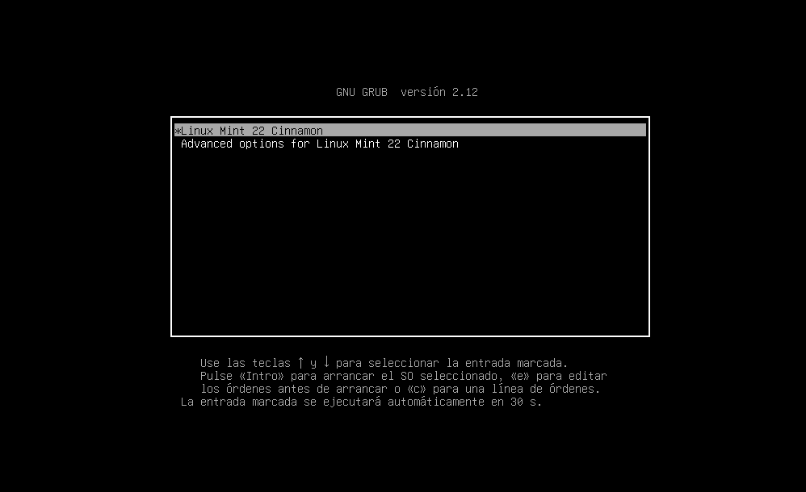

# *Manual Técnico ☝️🤓* 


## 📚 Contenido    


  - 🎯 Objetivos
  - 📍 Tecnologías
  - 🛠️ Herramientas
  - 💼 Paquetes
  - 🛡️ Guía Instalación


## 🎯 Objetivos


- Aprender a compilar el kernel de Linux.
- Aprender a realizar modificaciones al kernel de Linux.
- Comprender como funcionan las llamadas al sistema en Linux.


## 📍 Tecnologías

Estas son las tecnologías, herramientas y paquetes utilizados en el práctica:

- [**Imagen Linux Mint 22 Cinammon Edition**](https://www.linuxmint.com/download.php)
- [**Git**](https://git-scm.com/downloads) 
- [**Longterm**](https://kernel.org/)

## 🛠️ Herramientas
- [**VMware Workstation**](https://www.vmware.com/products/workstation-pro/workstation-pro-evaluation.html)
- [**Visual Studio Code:**](https://code.visualstudio.com/download)

## 💼 Paquetes

- **GCC**
- **Make**
- **build-essentia**
- **libncurses-dev**
- **bison**
- **flex**
- **libssl-dev**
- **libelf-dev**
- **fakeroot**
- **dwarves**

## 🛡️ Guía Instalación

## Paso 1: Actualizar el sistema

```bash
sudo apt update
sudo apt upgrade
```

## Paso 2: Instalar paquetes necesarios

```bash
sudo apt install build-essential libncurses-dev bison flex libssl-dev libelf-dev fakeroot dwarves
```

## Paso 3: Descargar el kernel de Linux

Visitar el sitio oficial de [Kernel.org](https://www.kernel.org/) y descargar la versión deseada (preferencia copiar link *tarball*).


Luego que copiamos el enlace `tarball` y con el siguiente comando lo descargarmos y comprimimos:

```bash
wget https://cdn.kernel.org/pub/linux/kernel/v6.x/linux-6.6.46.tar.xz
tar -xvf linux-6.6.46.tar.xz
```

## Paso 4: Configurar el kernel

Primero ingresamos a la carpeta del kernel:

```bash
cd linux-6.6.46
```

La configuración del kernel se debe especificar en un archivo .config. Para no escribir este desde 0 vamos a copiar el archivo de configuración de su Linux actualmente instalado:

```bash
cp -v /boot/config-$(uname -r) .config
```
Sin embargo, este esta lleno de modulos y drivers que no necesitamos que pueden aumentar el tiempo de compilación. Por lo que utilizamos el comando localmodconfig que analiza los módulos del kernel cargados de su sistema y modifica el archivo .config de modo que solo estos módulos se incluyan en la compilación. Tomar en cuenta que esto causará que nuestro kernel compilado solo funcione en nuestra maquina, por lo que si quieren que sea portatil omitan este paso. Y luego de poner el comando solo skipeamos los modulos con enter  hasta que aparezca nuestra terminal de nuevo..

```bash
make localmodconfig
```

Luego tenemos que modificar el .config, ya que al copiar nuestro .config se incluyeron nuestras llaves privadas, por lo que tendremos que reliminarlas del .config.

```bash
scripts/config --disable SYSTEM_TRUSTED_KEYS
scripts/config --disable SYSTEM_REVOCATION_KEYS
scripts/config --set-str CONFIG_SYSTEM_TRUSTED_KEYS ""
scripts/config --set-str CONFIG_SYSTEM_REVOCATION_KEYS ""
```

## Paso 5: Compilar el kernel

Primero verificamos cuantos nucleos tiene nuestra maquina para poder compilar el kernel de manera mas rapida:

```bash
nproc
```

Luego de esto procedemos a compilar el kernel, el `nproc` es el numero de nucleos que tiene nuestra maquina:
```bash
fakeroot make -j$(nproc)
```
Luego de esto empezará a compilar el kernel, dicho proceso puede tardar dependiendo de la potencia de su maquina y el numero de nucleos que tenga. Pero una vez que termine tendremos nuestro kernel compilado y para verificar que todo salio bien en el proceso de compilación podemos correr el siguiente comando:

```bash
echo $?
```

Si el comando anterior retorna un 0, entonces la compilación fue exitosa.

## Paso 6: Instalar el kernel

La instalación se divide en dos partes: instalar los módulos del kernel e instalar el kernel mismo.

Para instalar los módulos del kernel:

```bash
sudo make modules_install
```

Para instalar el kernel:

```bash
sudo make install
```

Luego de haber instalar el kernel, tenemos que actualizar el GRUB para que este pueda reconocer nuestro nuevo kernel:

```bash
sudo update-grub
```

Luego reiniciamos nuestra maquina con el siguiente comando:

```bash
sudo reboot
```

Justo en el instante que la maquina empieza a reiniciarse pulsamos las teclas `Shift + Esc` para que nos aparezca el menu de GRUB y seleccionamos nuestro nuevo kernel. Aparecerá la siguiente interfaz y pulsamos la opcion de `Advanced options for Linux Mint 22 Cinammon`:



Luego seleccionamos nuestro nuevo kernel que es el que tiene el numero de version que compilamos:


Luego de esto ya podremos ingreso a nuestra máquina virtual con nuestro nuevo kernel compilado.

## 💻☎️ Guía Edición del Kernel y Llamadas al Sistema:

## Paso 1: Cambiar el nombre del sistema operativo

Ingresamos  a la carpeta del kernel:

```bash
cd linux-6.6.46
```
Hacemos un ls para ver los archivos que contiene la carpeta:

```bash
ls
```


Luego de esto nos vamos a la siguiente path  `/linux-6.6.46/include/linux` y editamos el archivo `uts.h` con el siguiente comando y vamos a editar el nombre del sistema operativo `UTS_SYSNAME`: 

```bash
sudo nano uts.h
```


Luego de esto guardamos los cambios con `Ctrl + O` y salimos con `Ctrl + X`.

Luego de esto compilamos el kernel y para comprobar que los cambios se realizaron correctamente podemos correr el siguiente comando:

```bash
uname -rs
```
Y nos debería aparecer el nombre del sistema operativo que pusimos en el archivo `uts.h`.:


## Paso 2: Crear mensaje de bienvenida al iniciar el kernel

Para crear un mensaje de bienvenida al iniciar el kernel, nos vamos a la siguiente path `/linux-6.6.46/init` y editamos el archivo `main.c` con el siguiente comando:

```bash
sudo nano main.c
```

Luego de esto buscamos la funcion `start_kernel` y justo al inicio de la funcion agregamos el siguiente codigo:


Luego de esto guardamos los cambios con `Ctrl + O` y salimos con `Ctrl + X`.

Luego de esto compilamos el kernel y para comprobar que los cambios se realizaron correctamente podemos correr el siguiente comando:

```bash
dmesg | less
```

Y nos debería aparecer el mensaje de bienvenida que pusimos en el archivo `main.c`:


También podemos ver el mensaje con este otro comando:

```bash
dmesg | grep "Welcome"
dmesg | grep "201900647"
```


## Paso 3: Implementacion de llamadas al sistema

### Llamadas al sistema:
##### 1. Llamada al sistema para la hora actual en segundos
##### 2. Llamada al sistema que devuelve en segundos el tiempo que lleva encendido el sistema
##### 3. Llamada al sistema que devuelve los ultimos 5 logs del sistema


Primero vamos a la siguiente path `linux-6.6.45/arch/x86/entry/syscalls` y editamos el archivo `syscall_64.tbl` con el siguiente comando:

```bash
sudo nano syscall_64.tbl
```

Luego de esto agregamos las siguientes linea al final del archivo:


Luego de esto guardamos los cambios con `Ctrl + O` y salimos con `Ctrl + X`.

Luego de esto vamos a la siguiente path `/linux-6.6.45/include/linux` y editamos el archivo `syscalls.h` con el siguiente comando:

```bash
sudo nano syscalls.h
```


Luego de esto agregamos al final del archivo justo antes que termine un `#endif` las siguientes linea:


Luego de esto guardamos los cambios con `Ctrl + O` y salimos con `Ctrl + X`.


Luego de esto vamos a la siguiente path `/linux-6.6.45/kernel` y editamos el archivo `sys.c` con el siguiente comando:

```bash
sudo nano sys.c
```

Primero agregamos las librerias necesarias al inicio del archivo:


Luego de esto agregamos al final del archivo justo despues de la ultima funon `SYSCALL_DEFINE1` las siguientes lineas:

- Primer funcion:


- Segunda funcion:


- Tercera funcion:


Luego de realizar todos estos cambios en los 3 archivos `syscall_64.tbl`, `syscalls.h` y `sys.c` procedemos a compilar el kernel.

## Paso 4: Testear las llamadas al sistema

Luego de compilar el kernel y reiniciar la maquina, procedemos a testear las llamadas al sistema que implementamos.

#### Testeando nombre del sistema y mensaje de bienvenida:


Primero creamos un archivo llamado `call0.c` y dentro de el ponemos el siguiente codigo:


Luego accedemos via bash en donde se encuentra al archivo `call0.c` y corremos el siguiente comando:

```bash
gcc call0.c -o call0
```

Luego de esto corremos el siguiente comando:

```bash
./call0
```

Y nos debería aparecer el nombre del sistema operativo y el mensaje de bienvenida que pusimos en los archivos `uts.h` y `main.c` respectivamente.


#### Testeando la primera llamada al sistema:

Primero creamos un archivo llamado `call1.c` y dentro de el ponemos el siguiente codigo:


Luego accedemos via bash en donde se encuentra al archivo `call1.c` y corremos el siguiente comando:

```bash
gcc call1.c -o call1
```

Luego de esto corremos el siguiente comando:

```bash
./call1
```

Y nos debería aparecer la hora actual en segundos.

<p align="center">
  
</p>


#### Testeando la segunda llamada al sistema:

Primero creamos un archivo llamado `call2.c` y dentro de el ponemos el siguiente codigo:


Luego accedemos via bash en donde se encuentra al archivo `call2.c` y corremos el siguiente comando:

```bash
gcc call2.c -o call2
```

Luego de esto corremos el siguiente comando:

```bash
./call2
```

Y nos debería aparecer el tiempo que lleva encendido el sistema en segundos.
<p align="center">
  
</p>


#### Testeando la tercera llamada al sistema:

Primero creamos un archivo llamado `call3.c` y dentro de el ponemos el siguiente codigo:


Luego accedemos via bash en donde se encuentra al archivo `call3.c` y corremos el siguiente comando:

```bash
gcc call3.c -o call3
```

Luego de esto corremos el siguiente comando:

```bash
./call3
```

Y nos debería aparecer los ultimos 5 logs del sistema.


## 💻🐛❌ Bitácora de Errores:

Durante el proceso de implementación de las llamadas al sistema, se presentaron los siguientes errores:

- **Error 1:** 

```bash
drivers/char/random.c: In function ‘try_to_generate_entropy’:
drivers/char/random.c:1333:1: warning: the frame size of 1152 bytes is larger than 1024 bytes [-Wframe-larger-than=]
 1333 | }
      | ^
```

**Solución:** Este error se debe a que el tamaño del frame es mayor al permitido, para solucionar este error se debe agregar la siguiente linea al archivo `Makefile`, además acá habia un caracter en el `sys.c` que estaba de más por lo que lo borre y ya funciono:

```bash
KBUILD_CFLAGS += -Wno-frame-larger-than=
```


- **Error 2:** 

```bash
ibbpf: failed to find '.BTF' ELF section in vmlinux
FAILED: load BTF from vmlinux: No data available
make[2]: *** [scripts/Makefile.vmlinux:37: vmlinux] Error 255
make[2]: *** Se borra el archivo 'vmlinux'
make[1]: *** [/home/lall0g/linux-6.6.45/Makefile:1164: vmlinux] Error 2
make: *** [Makefile:234: __sub-make] Error 2
```

**Solución:** Este error se debe a que no se ha habilitado la opción de depuración de BTF en el archivo `.config`. Para solucionar este error se debe agregar la siguiente linea al archivo `.config` por lo que se solucionaba cuando reiniciaba la maquina y volvia a compilar el kernel.


- **Error 3:** 

```bash
                from kernel/sys.c:8:
./include/linux/stddef.h:8:14: warning: passing argument 4 of ‘kmsg_dump_get_buffer’ makes integer from pointer without a cast [-Wint-conversion]
    8 | #define NULL ((void *)0)
      |              ^~~~~~~~~~~
      |              |
      |              void *
kernel/sys.c:2896:61: note: in expansion of macro ‘NULL’
 2896 |     ret = kmsg_dump_get_buffer(5, log_buf, LOG_BUFFER_SIZE, NULL);
      |                                                             ^~~~
./include/linux/kmsg_dump.h:64:45: note: expected ‘size_t’ {aka ‘long unsigned int’} but argument is of type ‘void *’
   64 |                           char *buf, size_t size, size_t *len_out);
      |                                      ~~~~~~~^~~~
kernel/sys.c:2896:11: error: too few arguments to function ‘kmsg_dump_get_buffer’
 2896 |     ret = kmsg_dump_get_buffer(5, log_buf, LOG_BUFFER_SIZE, NULL);
      |           ^~~~~~~~~~~~~~~~~~~~
./include/linux/kmsg_dump.h:63:6: note: declared here
   63 | bool kmsg_dump_get_buffer(struct kmsg_dump_iter *iter, bool syslog,
      |      ^~~~~~~~~~~~~~~~~~~~
```

**Solución:** El error se debe a que la función kmsg_dump_get_buffer fue mal utilizada. Esta función requiere un objeto de tipo kmsg_dump_iter y varios parámetros adicionales solo cambie el objeto y ya funciono en el archivo `sys.c`.

## 📝📚 Referencias

- [**Linux Kernel Development**](https://www.doc-developpement-durable.org/file/Projets-informatiques/cours-&-manuels-informatiques/Linux/Linux%20Kernel%20Development,%203rd%20Edition.pdf)
