# *Manual Técnico ☝️🤓* 


## 📚 Contenido    


  - 🎯 Objetivos
  - 📍 Tecnologías
  - 🛠️ Herramientas
  - 💼 Paquetes
  - 🛡️ Guía Instalación


## 🎯 Objetivos


- Comprender como funcionan los hilos en Linux.
- Comprender los conceptos de concurrencia y paralelismo.
- Aplicar conceptos de sincronización de procesos.


## 📍 Tecnologías

Estas son las tecnologías, herramientas y paquetes utilizados en el práctica:

- [**Imagen Linux Mint 22 Cinammon Edition**](https://www.linuxmint.com/download.php)
- [**Git**](https://git-scm.com/downloads) 
- [**Longterm**](https://kernel.org/)

## 🛠️ Herramientas
- [**VMware Workstation**](https://www.vmware.com/products/workstation-pro/workstation-pro-evaluation.html)
- [**Visual Studio Code:**](https://code.visualstudio.com/download)

## 💼 Paquetes

- **GCC**
- **Make**
- **build-essentia**
- **libncurses-dev**
- **bison**
- **flex**
- **libssl-dev**
- **libelf-dev**
- **fakeroot**
- **dwarves**

## 🛡️ Guía Instalación

## Paso 1: Actualizar el sistema

```bash
sudo apt update
sudo apt upgrade
```

## Paso 2: Instalar paquetes necesarios

```bash
sudo apt install build-essential libncurses-dev bison flex libssl-dev libelf-dev fakeroot dwarves
```

## Paso 3: Descargar el kernel de Linux

Visitar el sitio oficial de [Kernel.org](https://www.kernel.org/) y descargar la versión deseada (preferencia copiar link *tarball*).

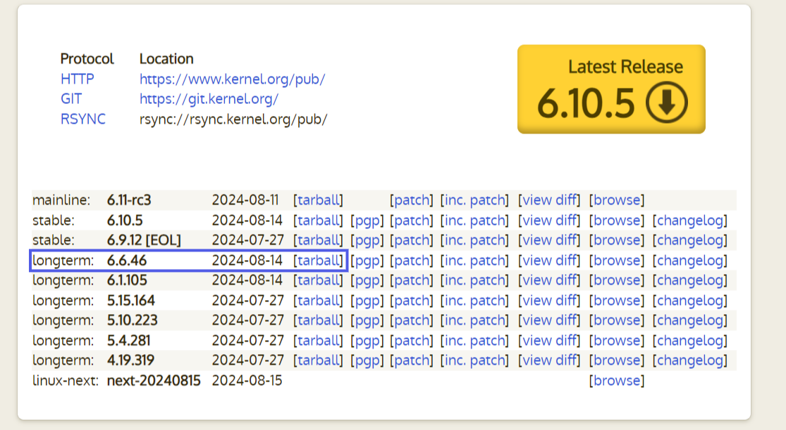

Luego que copiamos el enlace `tarball` y con el siguiente comando lo descargarmos y comprimimos:

```bash
wget https://cdn.kernel.org/pub/linux/kernel/v6.x/linux-6.6.46.tar.xz
tar -xvf linux-6.6.46.tar.xz
```

## Paso 4: Configurar el kernel

Primero ingresamos a la carpeta del kernel:

```bash
cd linux-6.6.46
```

La configuración del kernel se debe especificar en un archivo .config. Para no escribir este desde 0 vamos a copiar el archivo de configuración de su Linux actualmente instalado:

```bash
cp -v /boot/config-$(uname -r) .config
```
Sin embargo, este esta lleno de modulos y drivers que no necesitamos que pueden aumentar el tiempo de compilación. Por lo que utilizamos el comando localmodconfig que analiza los módulos del kernel cargados de su sistema y modifica el archivo .config de modo que solo estos módulos se incluyan en la compilación. Tomar en cuenta que esto causará que nuestro kernel compilado solo funcione en nuestra maquina, por lo que si quieren que sea portatil omitan este paso. Y luego de poner el comando solo skipeamos los modulos con enter  hasta que aparezca nuestra terminal de nuevo..

```bash
make localmodconfig
```

Luego tenemos que modificar el .config, ya que al copiar nuestro .config se incluyeron nuestras llaves privadas, por lo que tendremos que reliminarlas del .config.

```bash
scripts/config --disable SYSTEM_TRUSTED_KEYS
scripts/config --disable SYSTEM_REVOCATION_KEYS
scripts/config --set-str CONFIG_SYSTEM_TRUSTED_KEYS ""
scripts/config --set-str CONFIG_SYSTEM_REVOCATION_KEYS ""
```

## Paso 5: Compilar el kernel

Primero verificamos cuantos nucleos tiene nuestra maquina para poder compilar el kernel de manera mas rapida:

```bash
nproc
```

Luego de esto procedemos a compilar el kernel, el `nproc` es el numero de nucleos que tiene nuestra maquina:
```bash
fakeroot make -j$(nproc)
```
Luego de esto empezará a compilar el kernel, dicho proceso puede tardar dependiendo de la potencia de su maquina y el numero de nucleos que tenga. Pero una vez que termine tendremos nuestro kernel compilado y para verificar que todo salio bien en el proceso de compilación podemos correr el siguiente comando:

```bash
echo $?
```

Si el comando anterior retorna un 0, entonces la compilación fue exitosa.

## Paso 6: Instalar el kernel

La instalación se divide en dos partes: instalar los módulos del kernel e instalar el kernel mismo.

Para instalar los módulos del kernel:

```bash
sudo make modules_install
```

Para instalar el kernel:

```bash
sudo make install
```

Luego de haber instalar el kernel, tenemos que actualizar el GRUB para que este pueda reconocer nuestro nuevo kernel:

```bash
sudo update-grub
```

Luego reiniciamos nuestra maquina con el siguiente comando:

```bash
sudo reboot
```

Justo en el instante que la maquina empieza a reiniciarse pulsamos las teclas `Shift + Esc` para que nos aparezca el menu de GRUB y seleccionamos nuestro nuevo kernel. Aparecerá la siguiente interfaz y pulsamos la opcion de `Advanced options for Linux Mint 22 Cinammon`:

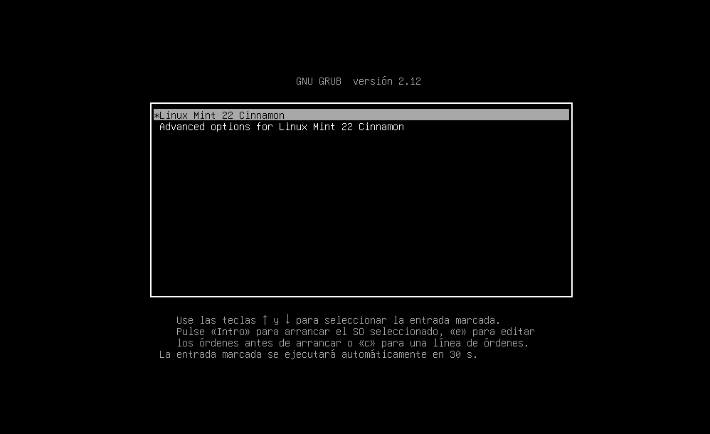

Luego seleccionamos nuestro nuevo kernel que es el que tiene el numero de version que compilamos:

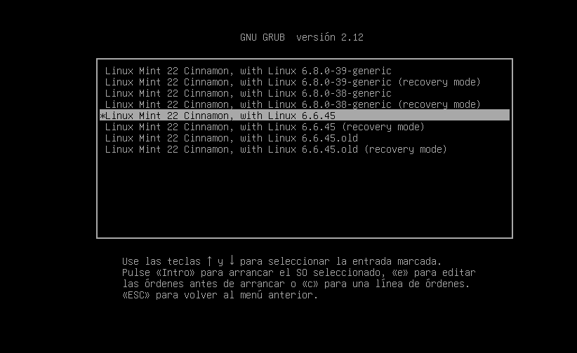


Luego de esto ya podremos ingreso a nuestra máquina virtual con nuestro nuevo kernel compilado.
## Paso 7: Instalar librerias para utilizar la api

Ulfius está disponible en múltiples distribuciones como paquete oficial. Para instalar Ulfius en Ubuntu, primero necesitamos instalar las dependencias:

```bash
sudo apt install libulfius-dev uwsc
```

La instalación de Jansson deberá de realizarse de forma manual.
El codigo fuente de Jansson está disponible en http://www.digip.org/jansson/releases/.
Desempaquete el archivo tar de origen y cambie al directorio de origen:

```bash
bunzip2 -c jansson-X.Y.Z.tar.bz2 | tar xf -
cd jansson-X.Y.Z
```

Luego se creará una carpeta build y se generarán los archivos make utilizando CMake

```bash
mkdir build
d build
make .. # o ccmake .. para utilizar una GUI.
```
Una vez creados los archivos de make se compilará
  
  ```bash
make
make check
make install
```

Luego ya podemos compilar nuestro kernel


## 💻☎️ Guía Edición del Kernel y Llamadas al Sistema:

## Paso 1: Cambiar el nombre del sistema operativo

Ingresamos  a la carpeta del kernel:

```bash
cd linux-6.6.46
```
Hacemos un ls para ver los archivos que contiene la carpeta:

```bash
ls
```
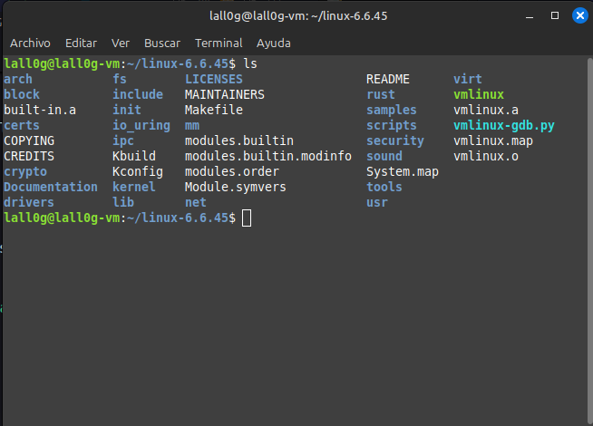


## Paso 2: Implementacion de llamadas al sistema

### Llamadas al sistema:
##### 1. Llamada al sistema para encriptar.
##### 2. Llamada al sistema para desencriptar.


Primero vamos a la siguiente path `linux-6.6.45/arch/x86/entry/syscalls` y editamos el archivo `syscall_64.tbl` con el siguiente comando:

```bash
sudo nano syscall_64.tbl
```

Luego de esto agregamos las siguientes linea al final del archivo:

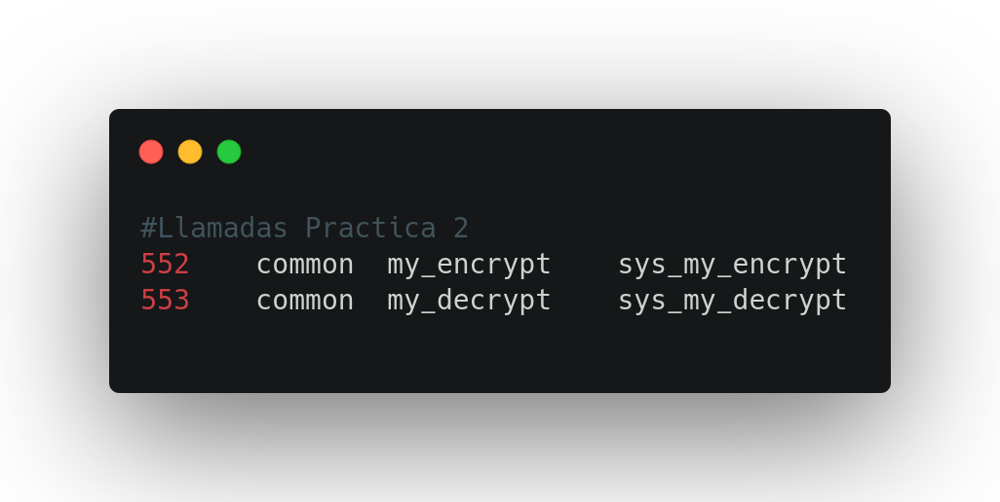

Luego de esto guardamos los cambios con `Ctrl + O` y salimos con `Ctrl + X`.

Luego de esto vamos a la siguiente path `/linux-6.6.45/include/linux` y creamos el archivo `syscalls_usac.h` con el siguiente comando:

```bash
sudo nano syscalls_usac.h
```


Luego de esto agregamos  las siguientes linea, para definir las syscall:

```c++
#ifndef _SYSCALLS_USAC_H_
#define _SYSCALLS_USAC_H_
#include <linux/linkage.h>
#include <linux/types.h>
#include <linux/kernel.h>

// Definición de las syscalls
asmlinkage long sys_my_encrypt(const char __user *input_path, const char __user *output_path, int num_threads, const char __user *key_path);
asmlinkage long sys_my_decrypt(const char __user *input_path, const char __user *output_path, int num_threads, const char __user *key_path);

#endif /* _LINUX_SYSCALLS_USAC_H */
```
Luego de esto guardamos los cambios con `Ctrl + O` y salimos con `Ctrl + X`.


Luego de esto vamos a la siguiente path `/linux-6.6.45/kernel` y creamos el archivo `syscalls_usac.c` con el siguiente comando:

```bash
sudo nano syscalls_usac.c
```

Primero agregamos las librerias necesarias al inicio del archivo:

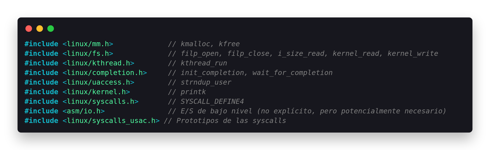


Luego de esto agregamos las siguientes funciones al archivo:
- Función para encriptar

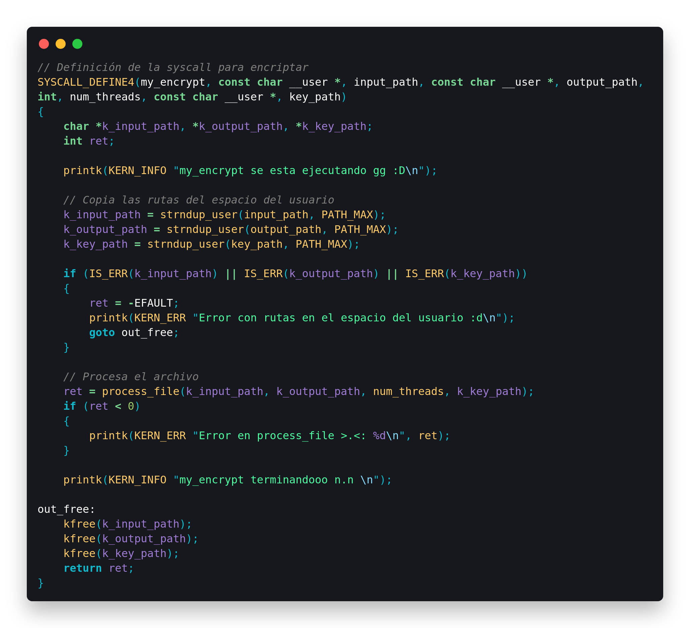

- Función para desencriptar

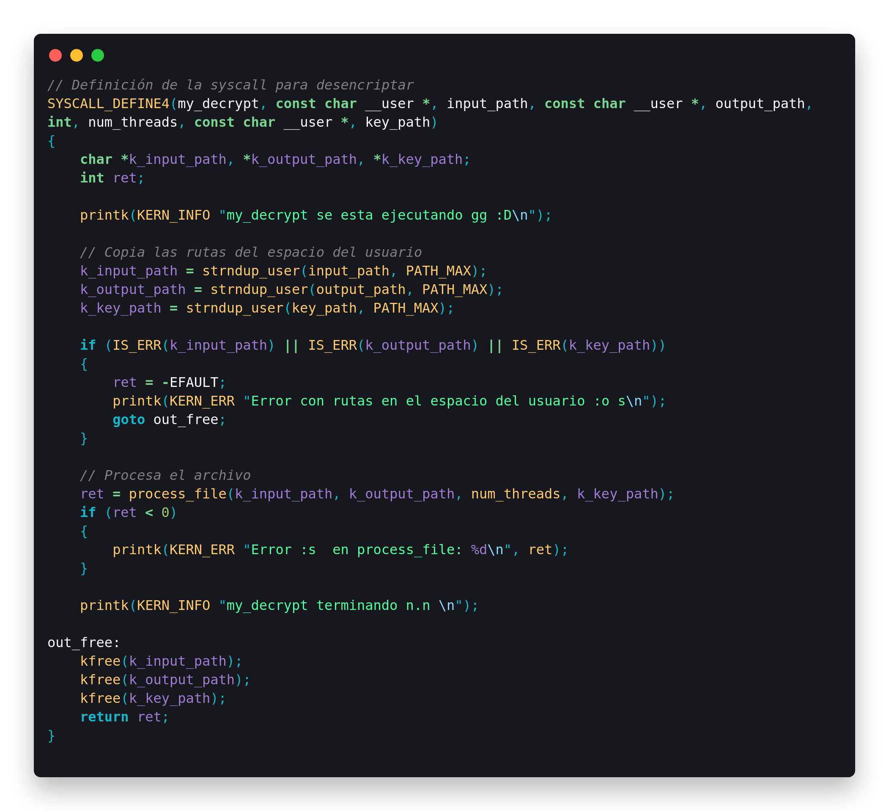

Realmente hay más código en el archivo, pero este es el más importante. Luego de esto guardamos los cambios con `Ctrl + O` y salimos con `Ctrl + X`.

- Funcion para obtener la memoria ram libre, usada y cache
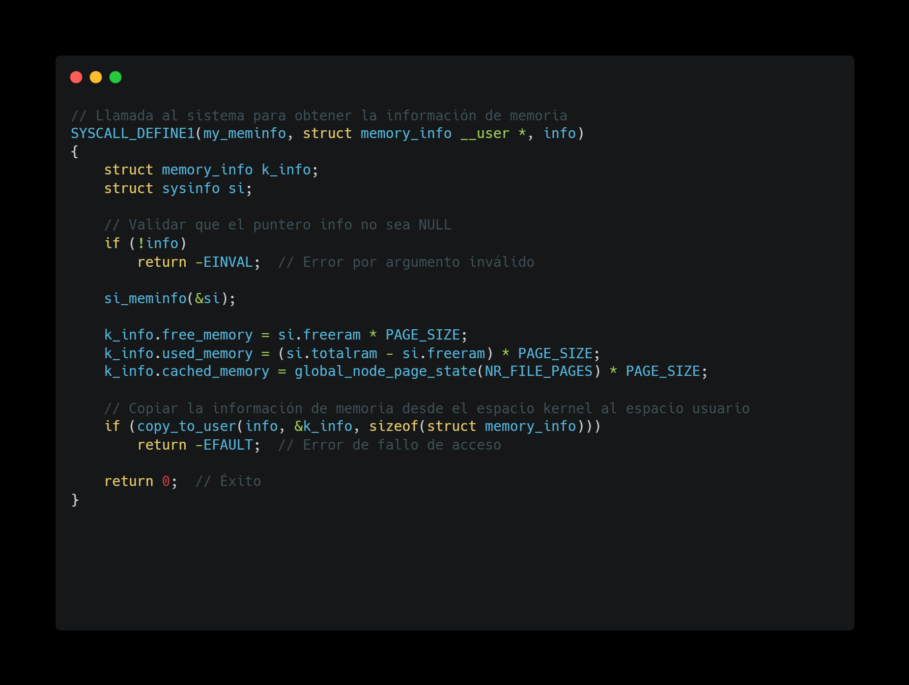

- Funcion para obtener la memoria swap
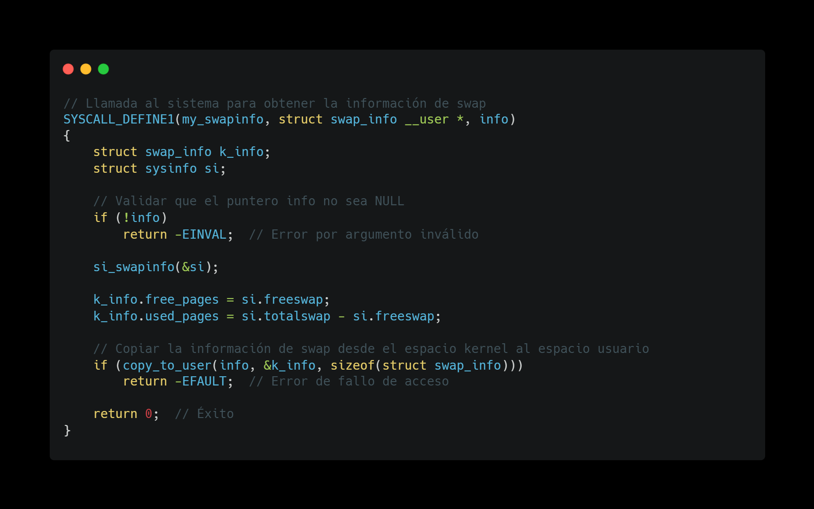

- Funcion para obtener la informacion de fallas de paginacion
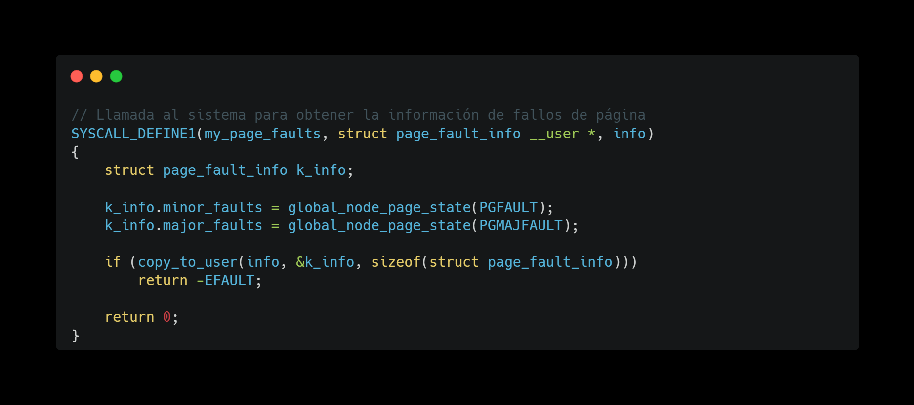

- Funcion para obtener las paginas activas, inactivas
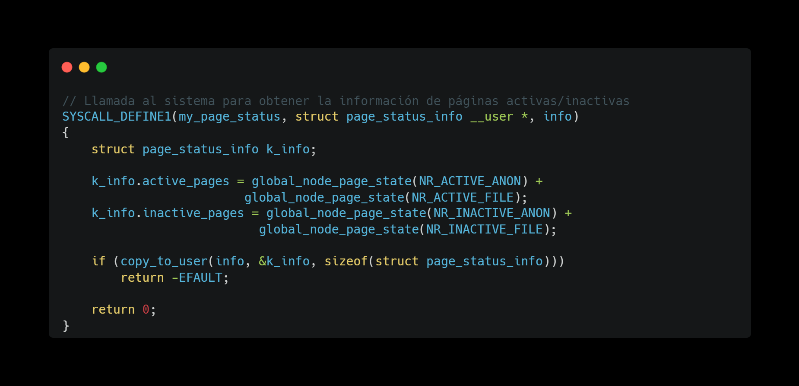

- Funcion para obtener top 5 procesos que consumen mas memoria


Luego de realizar todos estos cambios en los 3 archivos `syscall_64.tbl`, `syscalls_usac.h` y `syscalls_usac.c` procedemos a compilar el kernel, si no hay errores en la compilación procedemos a instalar el kernel, actualizar el GRUB y reiniciar la maquina.

## Paso 3: Testear las llamadas al sistema

Luego de compilar el kernel y reiniciar la maquina, procedemos a testear las llamadas al sistema que implementamos.

#### Testeando la llamada al sistema para encriptar:
Primero creamos un archivo llamado `encrypt_app.c` y dentro de el ponemos el siguiente codigo:

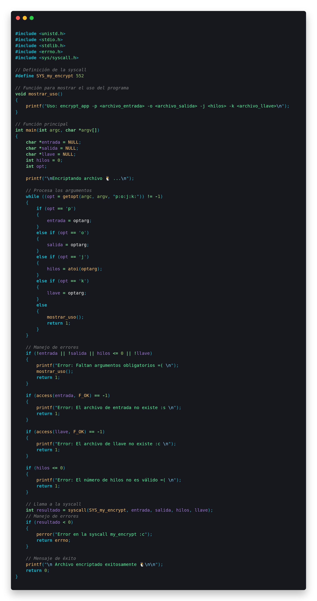

Luego accedemos via bash en donde se encuentra al archivo `encrypt_app.c` y corremos el siguiente comando:

```bash
gcc encrypt_app.c -o encrypt_app
```

Luego de esto corremos el siguiente comando:

```bash
sudo ./encrypt_app -p archivo_entrada.txt -o archivo_salida.txt -j 2  -k clave.txt
```

Y nos debería aparecer el siguiente mensaje en consola:

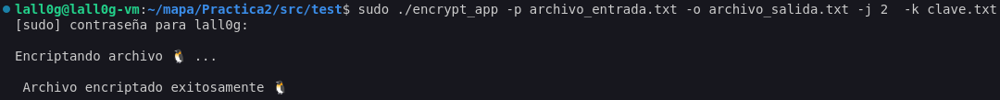

Luego verificiamos el archivo de salida y debería estar encriptado asi:

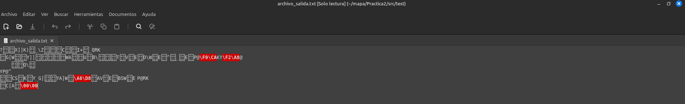
#### Testeando la llamada al sistema para desencriptar:

Primero creamos un archivo llamado `decrypt_app.c` y dentro de el ponemos el siguiente codigo:

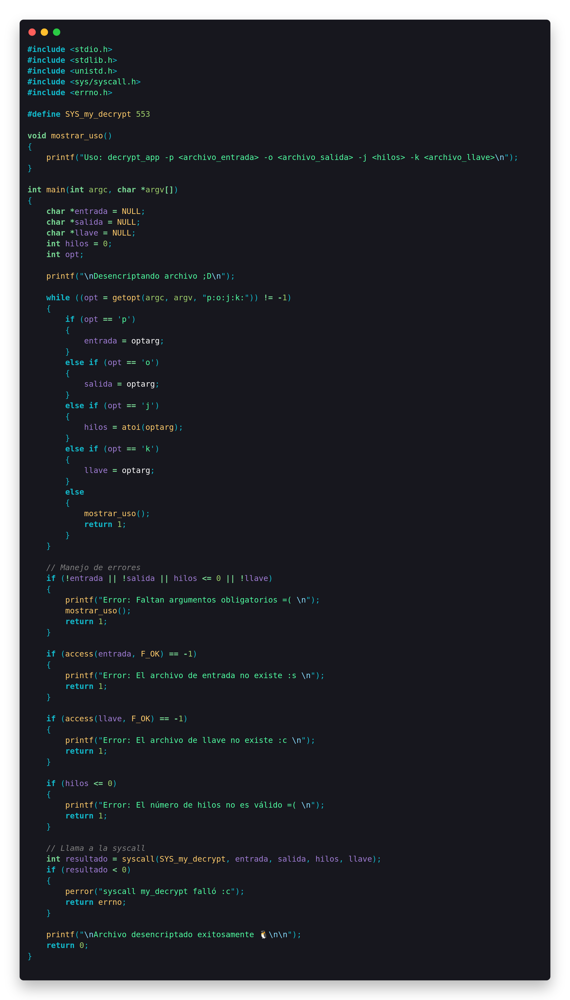

Luego accedemos via bash en donde se encuentra al archivo `decrypt_app.c` y corremos el siguiente comando:

```bash
gcc decrypt_app.c -o decrypt_app
```

Luego de esto corremos el siguiente comando:

```bash
sudo ./decrypt_app -p archivo_salida.txt -o archivo_desenc.txt -j 2  -k clave.txt
```

Y nos debería aparecer el siguiente mensaje en consola:

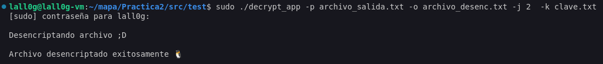

Luego verificiamos el archivo de salida y debería estar encriptado asi:

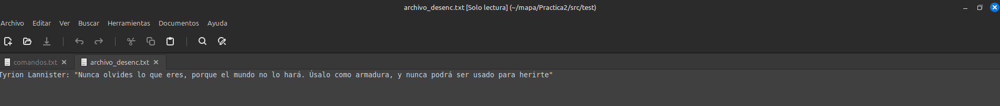


#### Testeando la llamada al sistema con la api:

Primero creamos un archivo llamado `api.c` y dentro de el ponemos el siguiente codigo:
```c
gcc api.c -o api -lulfius -ljansson
```

Luego accedemos via bash en donde se encuentra al archivo `api` y corremos el siguiente comando:

```bash
./api
```

Adjunto el codigo de la api:

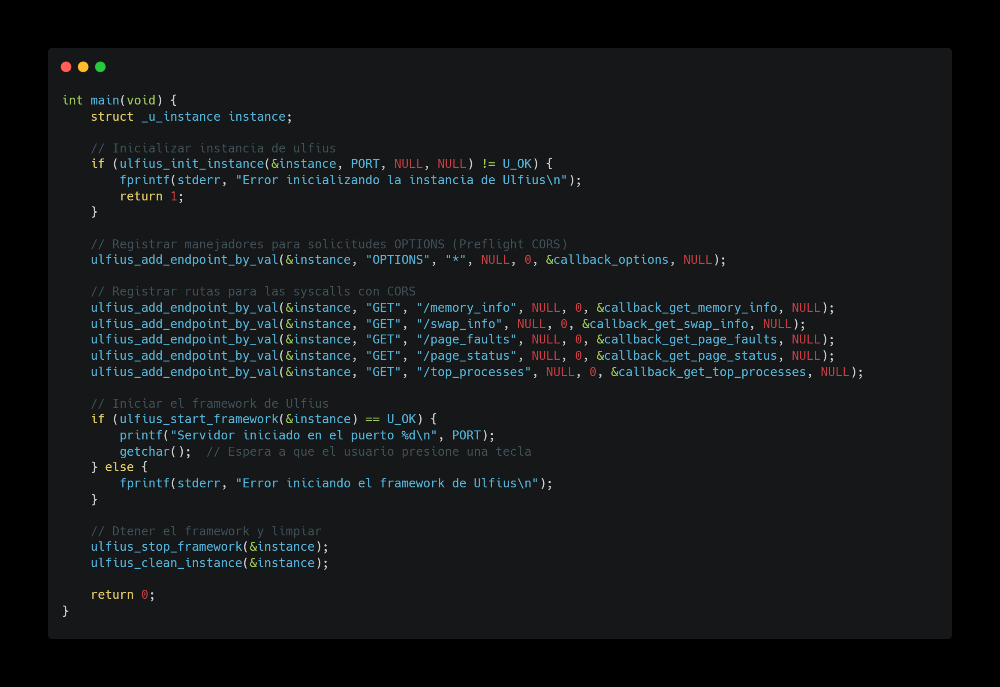


#### Diseño del frontend:
 Se utilizò React para el diseño del frontend, se utilizò el siguiente comando para correr el frontend:

```bash
npm run dev
```

##### Pagina de inicio:


##### Dashboard:

Aca se muestra la informacion de la memoria ram, swap, fallas de paginacion, paginas activas e inactivas y los top 5 procesos que consumen mas memoria
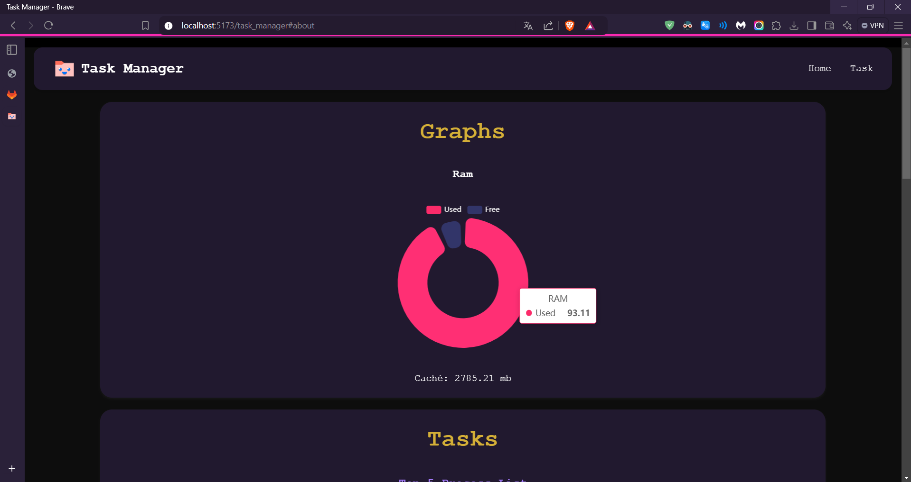
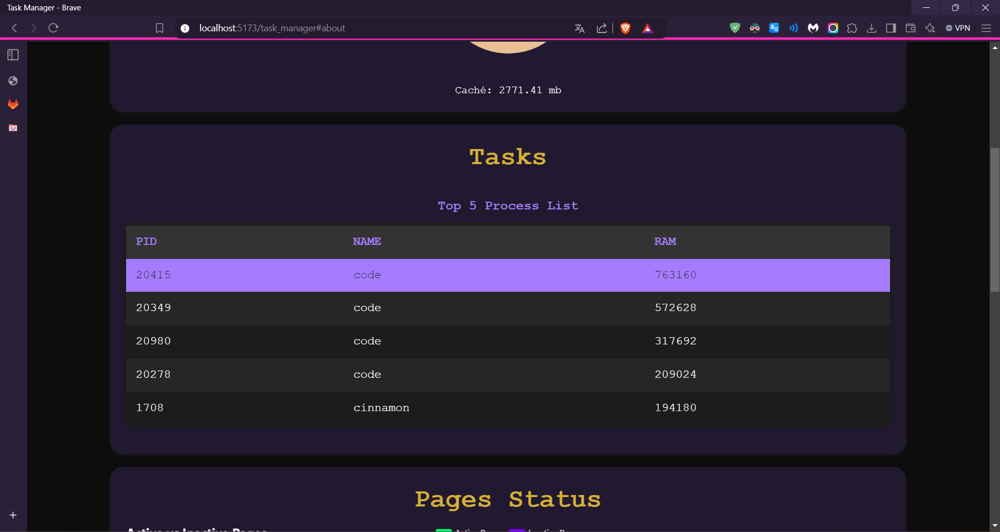
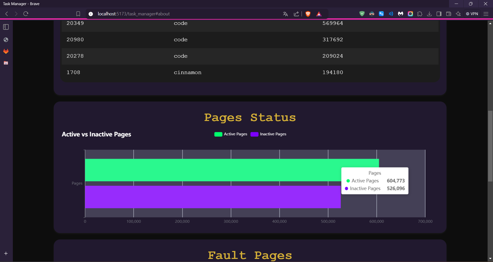

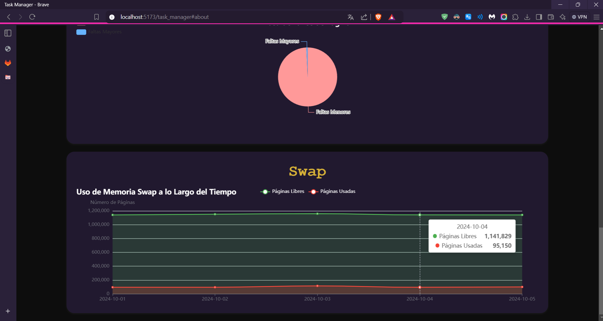


## 💻🐛❌ Bitácora de Errores:

Durante el proceso de implementación de las llamadas al sistema, se presentaron los siguientes errores:

- **Error 1:** 

```bash
In file included from kernel/syscalls_usac.c:75:
./include/linux/syscalls_usac.h:57:2: error: expected ‘;’ before ‘extern’
   57 | v

```

**Solución:** Este error me apreciò porque puse un caracter de mas en el archivo `syscalls_usac.h`, por lo que se soluciono eliminando el caracter de mas y volviendo a compilar el kernel.


- **Error 2:** 

```bash
  CC      drivers/char/random.o
drivers/char/random.c: In function ‘try_to_generate_entropy’:
drivers/char/random.c:1333:1: warning: the frame size of 1152 bytes is larger than 1024 bytes [-Wframe-larger-than=]
 1333 | }
      | ^
```

**Solución:** Este error se debe a que el tamaño del marco de la pila es mayor a 1024 bytes, por lo que se soluciono reiniciando la maquina y volviendo a compilar el kernel.

- **Error 3:** 

```bash
ernel/syscalls_usac.c:336:1: error: macro "__MAP3" requires 4 arguments, but only 2 given
  336 | SYSCALL_DEFINE4(my_meminfo, struct memory_info __user *, info)
      | ^~~~~~
In file included from kernel/syscalls_usac.c:42:
./include/linux/syscalls.h:115: note: macro "__MAP3" defined here
  115 | #define __MAP3(m,t,a,...) m(t,a), __MAP2(m,__VA_ARGS__)
      | 
./include/linux/syscalls.h:116:35: error: ‘__MAP3’ undeclared here (not in a function)
  116 | #define __MAP4(m,t,a,...) m(t,a), __MAP3(m,__VA_ARGS__)
      |                                   ^~~~~~
./include/linux/syscalls.h:119:22: note: in expansion of macro ‘__MAP4’
  119 | #define __MAP(n,...) __MAP##n(__VA_ARGS__)
      |                      ^~~~~
./include/linux/syscalls.h:175:17: note: in expansion of macro ‘__MAP’
  175 |                 __MAP(nb,__SC_STR_TDECL,__VA_ARGS__)            \
      |                 ^~~~~
./include/linux/syscalls.h:230:9: note: in expansion of macro ‘SYSCALL_METADATA’
  230 |         SYSCALL_METADATA(sname, x, __VA_ARGS__)                 \
      |         ^~~~~~~~~~~~~~~~
./include/linux/syscalls.h:223:36: note: in expansion of macro ‘SYSCALL_DEFINEx’
  223 | #define SYSCALL_DEFINE4(name, ...) SYSCALL_DEFINEx(4, _##name, __VA_ARGS__)
      |                                    ^~~~~~~~~~~~~~~
kernel/syscalls_usac.c:336:1: note: in expansion of macro ‘SYSCALL_DEFINE4’
  336 | SYSCALL_DEFINE4(my_meminfo, struct memory_info __user *, info)
      | ^~~~~~~~~~~~~~~
kernel/syscalls_usac.c:336:1: error: macro "__MAP3" requires 4 arguments, but only 2 given
  336 | SYSCALL_DEFINE4(my_meminfo, struct memory_info __user *, info)
      | ^~~~~~
./include/linux/syscalls.h:115: note: macro "__MAP3" defined here
  115 | #define __MAP3(m,t,a,...) m(t,a), __MAP2(m,__VA_ARGS__)

```

**Solución:**  Este error se debe a que no se definio correctamente la llamada al sistema, por lo que se soluciono definiendo correctamente la llamada al sistema y volviendo a compilar el kernel.

## 📝📚 Referencias

- [**Linux Kernel Development**](https://www.doc-developpement-durable.org/file/Projets-informatiques/cours-&-manuels-informatiques/Linux/Linux%20Kernel%20Development,%203rd%20Edition.pdf)
